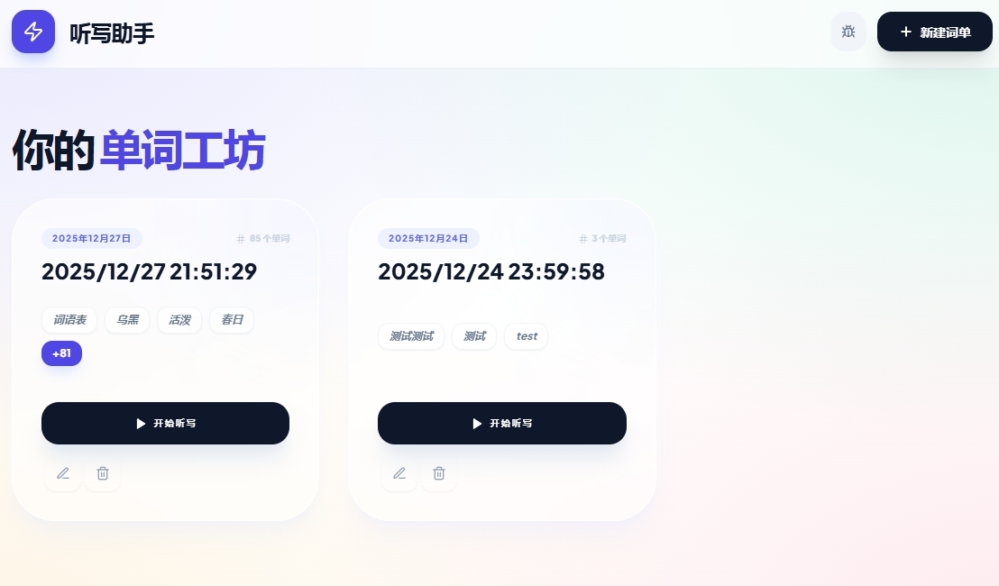
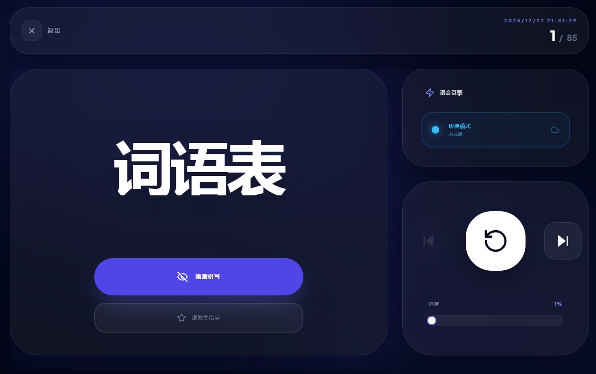

# LingoEcho - 极简语音背单词助手

LingoEcho 是一个面向英语学习场景的 Web App：支持文字、语音、拍照识词创建词单，通过 Gemini OCR 解析图片内容，并用 Microsoft Edge TTS、GLM TTS 或浏览器 Web Speech API 播放发音。v3.1.0 起所有可选 AI API key 都保存在 Vercel Edge Functions，纯朗读场景 0 key 可跑。

## ✨ 功能特性

- **📝 多方式创建词单**：支持文字输入、语音输入和拍照自动识别，按场景选择最快的录入方式。
- **📸 视觉识词**：通过 Gemini OCR 解析教材图片、练习页或词表中的英文内容。
- **🚩 生词标记与重默**：把不熟的词标记为生词字，自动进入重默列表，集中强化薄弱项。
- **🔀 打乱顺序**：学习和复习时可打乱单词顺序，减少对固定位置和顺序的依赖。
- **🔊 多 TTS 引擎**：Edge TTS 免费首选，GLM TTS 可选 fallback，浏览器 Web Speech API 负责本地降级。
- **📱 跨设备适配**：同时适配电脑和移动端，支持桌面多列管理、手机拍图识词和触摸式复习。
- **🧩 可部署副本**：Vite + React + Vercel Edge Functions，适合快速 fork 后部署自己的实例。

## 🛠️ 技术栈

- **Frontend**: Vite, React 19, TypeScript
- **Styling**: Tailwind CSS
- **Backend**: Vercel Edge Functions
- **OCR**: Gemini OCR (optional, for image recognition)
- **TTS**: Microsoft Edge TTS, GLM TTS, Web Speech API
- **Deployment**: Vercel

## 📦 API 端点

| Endpoint | Method | 用途 |
| --- | --- | --- |
| `/api/ocr` | `POST` | 使用 Gemini OCR 解析图片内容，需要 `GEM_API_KEY` |
| `/api/tts-edge` | `POST` | Microsoft Edge TTS，免费、无需 key，v3.0.0 默认首选 |
| `/api/tts-glm` | `POST` | 智谱 GLM TTS，可选 fallback，需要 `GLM_API_KEY` |
| `/api/tts-available` | `GET` / `POST` | 探测当前可用的 TTS 后端 |

## 🔑 Environment Variables

| Variable | 必需 | 用途 |
| --- | --- | --- |
| `GEM_API_KEY` | **可选**（仅 OCR 用） | Gemini OCR，用于图片识词；纯朗读不需要 |
| `GLM_API_KEY` | **可选**（备用 TTS 渠道） | GLM TTS fallback |

变量配置在服务端环境中；本项目不需要 `VITE_` 前缀，纯 TTS 场景 0 key 可跑。

## 🔊 TTS 优先级

1. **Microsoft Edge TTS**：默认首选，免费、无需 key。
2. **GLM TTS**：配置 `GLM_API_KEY` 后作为云端 fallback。
3. **Web Speech API**：浏览器本地降级方案。

纯朗读默认走 Edge TTS；失败后按 GLM TTS、Web Speech API 顺序降级。

## 📱 跨设备适配

- **电脑端**：词单多列管理，学习页左右分栏，适合鼠标点击和大屏复习。
- **移动端**：支持拍图识词、相册选择、触摸式复习和底部操作栏。
- **响应式学习页**：全屏大字展示、播放控制、进度拖动覆盖手机和平板场景。

## 🚀 本地开发

```bash
git clone <your-fork-url>
cd WordReciter
npm install
```

创建 `.env.local`：

```bash
GEM_API_KEY=your_gemini_key
GLM_API_KEY=your_glm_key
```

```bash
npm run dev
```

默认地址：`http://localhost:3000`。

## ☁️ Vercel 部署

两种方式：GitHub 集成适合自动部署和 PR Preview；Vercel CLI 适合本地手动部署。生产实例：<https://tx.wutao6.cfd/>

| 配置项 | 推荐值 |
| --- | --- |
| Framework Preset | `Vite` |
| Build Command | `npm run build` |
| Output Directory | `dist` |
| Install Command | `npm install` |

| Environment Variable | 用途 |
| --- | --- |
| `GEM_API_KEY` | 可选，仅 OCR 图片识词使用 |
| `GLM_API_KEY` | 可选，仅备用 TTS 使用 |

`vercel.json` 中为 API 配置了 60 秒超时：
```json
{"functions":{"api/**/*.ts":{"maxDuration":60}}}
```
```bash
npm i -g vercel
vercel
vercel --prod
```
自定义域名：在 Vercel Project 的 `Settings` -> `Domains` 添加域名，并按提示配置 DNS 记录。
Smoke test:
```bash
curl https://<your-domain>/api/tts-available
curl -i -X POST https://<your-domain>/api/tts-edge -H 'Content-Type: application/json' --data '{"text":"Hello LingoEcho"}' --output /tmp/test-edge.mp3
```

## 📜 版本历史

| Version | 关键变化 |
| --- | --- |
| `v1.0.0` | 初始公开版本。GLM TTS、Azure TTS 和 Gemini 相关 key 曾被注入前端 bundle，存在 3 个 key 泄漏风险。 |
| `v2.0.0` | 安全修复。所有 key 移到 Vercel Edge Functions，新增 `/api/ocr`、`/api/tts-glm`、`/api/tts-azure` 3 个后端端点。 |
| `v3.0.0` | 用免费 Microsoft Edge TTS 替换 Azure TTS 作为默认云端语音方案；新增 `/api/tts-edge` 和 `/api/tts-available`；`vercel.json` 为 API 函数配置 `maxDuration: 60`。 |
| `v3.1.0` | 彻底移除 Azure TTS（删除 `api/tts-azure.ts`），简化环境变量（全部可选），强化“纯朗读 0 key”卖点。 |

## 📸 Screenshots

### 电脑端 · 听写助手主界面

历史听写记录、词数、标签和快速复习入口。



### 电脑端 · 单词复习主界面

大字复习、拼写隐藏、TTS 切换、播放控制和进度条。



> 📱 **移动端**：支持拍图识词、触摸复习和底部固定操作栏；截图稍后补充。

## 🛡️ License / 致谢

本项目用于学习和个人部署场景，License 信息按 fork 或部署需求补充。
Thanks to Gemini OCR、Microsoft Edge TTS、GLM TTS、Vercel 和开源前端生态。
